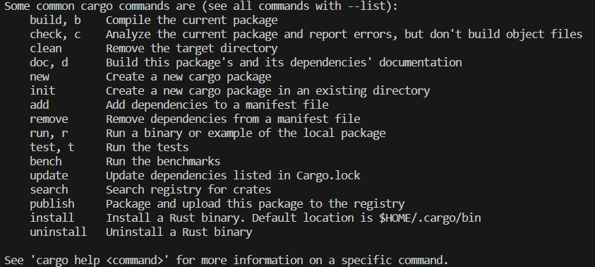
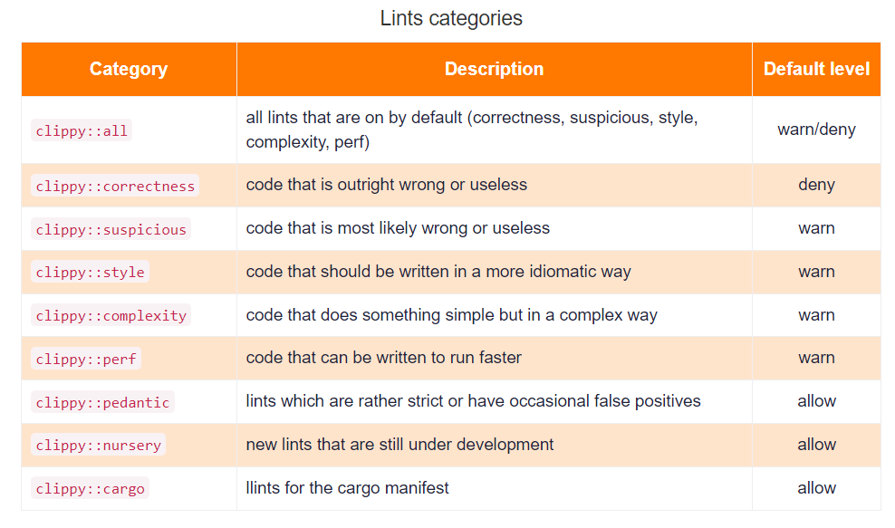

# New Rust Program

```cargo``` 集成RUST编译和运行工具


## 初始化新的Rust项目
- ```cargo new xxxx```
- 在当前目录下创建package, 项目内初始化 src/main.rs、Cargo.toml文件
- Cargo.toml： 项目的配置文件，内部包含项目依赖包，包含项目编译需要的所有元数据
## 在已有的目录下初始化项目
- ```cargo init hello```
package hello 下初始化 src/main.rs、Cargo.toml文件

## 编译/运行项目
- cargo build (--release) // cargo run (--release)
- --release表示当前项目用于生产环境（默认为debug），生产环境下，程序会做大量的性能优化

通过 ```cargo fmt``` 和 ```cargo clippy``` 格式化和检查代码

## 依赖包资料
[查询依赖](https://crates.io/)
[依赖包的函数简介](https://docs.rs/)


