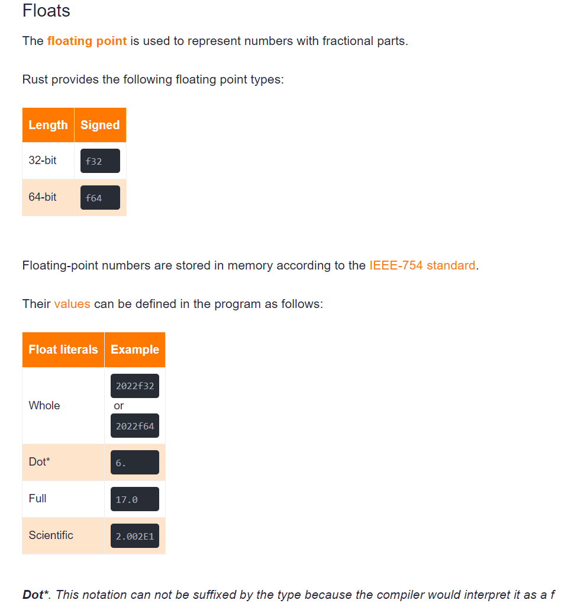

# RUST DataType

## scalar (simple) 
### Integers
<details>
<summary> Signed</summary>

有符号变量可以表示 负数， examples <code>i8 means -128~127</code>
Read more on  [Signed](https://careerbooster.teachable.com/courses/1869000/lectures/43560676).

```text
fn main() {
    let hell:i8 = 16;
    println!("{}",hell);
    let neghell:i8 = -6;
    println!("{}",neghell);
}
```
</details>

<details>
<summary>Unsigned</summary>

无符号变量仅表示正整数, examples <code>u8 means 0~255</code>
</details>

- Floating-point numbers
浮点数用于表示小数
<details>
<summary> Type</summary>
浮点数由f32 和 f64 两种长度。

定义浮点数变量有四种：

```text
fn main() {
    let hell:f32 = 123f32;
    println!("{}",hell);
    let hell1:f64 = 456f64;
    println!("{}",hell1);
    let hell2:f32 = 123.;
    println!("{}",hell2);
    let hell3:f32 = 123.789;
    println!("{}",hell3);
    let hell4:f32 = 123.789E2;
    println!("{}",hell4);
}
```
</details>

### Booleans
(true/false)bool变量占用1-bit的内存空间
```text
fn main() {
    let hell:bool = true;
    println!("{}",hell);
}
```

### Characters
<details>
<summary> char</summary>

char变量存储单一字符变量
```text
fn main() {
    let hell1:char = 'H';
    println!("{}",hell1);
}
```
</details>

<details>
<summary>str</summary>

字符串类型str，需要用 & 指定不定长的存储空间
```text
fn main() {
    let hell:&str = "Hell World!";
    println!("{}",hell);
}
```
</details>

## compound (combined)

### Array
数组分为定长和不定长数组，数组内部参数的类型和数组类型一致。
<details>
<summary>定长数组</summary>

Array定长数组，在定义时指定类型和长度：<code>[T;N]</code> where T is he type and the N is the size of the array. 或者 直接初始化数组。总之数组长度固定。
```text
fn main() {
    let array: [u32; 3] = [1, 2, 3]; // let array = [1, 2, 3]; 
    println!("{}", array[0]); // 1
    println!("{}", array[1]); // 2
    println!("{}", array[2]); // 3
}
```
</details>
<details>
<summary>不定长数组</summary>

不定长数组叫做切片，在定义时通过指定内存地址分配不定长空间，切片数组长度不固定。
```text
fn main() {
    let array: &[u32] = &[1, 2, 3]; // let array = &[1, 2, 3]; 
    println!("{}", array[0]); // 1
    println!("{}", array[1]); // 2
    println!("{}", array[2]); // 3
}
```
</details>

### Tuples
元组数组中各参数的类型可以不一致，用于输入/接收不同类型的数据变量
```text
fn main() {
    let tuple: (bool, u32, i8, f32) = (true, 45, -4, 45.098);
    println!("{}", tuple.0); // true
    println!("{}", tuple.1); // 45
    println!("{}", tuple.2); // -4
    println!("{}", tuple.3); // 45.098
                             // tuple.4 would result in a compilation error!
}
```
### Struct
结构体用于表示通用的数据结构，内部参数可以指定名称或者直接通过类型定义

结构体内部参数在new 新的对象时必须全部初始化新的值。
<details>
<summary>参数定义的结构体</summary>
```text
fn main() {
    struct Mytuple {
        bool_param: bool,
        uint_param: u32,
        int_param: i8,
        float_param: f32,
    }
    let tuple = Mytuple {
        bool_param: true,
        uint_param: 45,
        int_param: -4,
        float_param:45.098 // Error 如果缺失结构体中的浮点数的值的话，就会报错missing `float_param`
    };
    println!("{}", tuple.bool_param); // true
    println!("{}", tuple.uint_param); // 45
    println!("{}", tuple.int_param); // -4
    println!("{}", tuple.float_param); // 45.098  
                                     // tuple.4 would result in a compilation error!
}
```
</details>

<details>
<summary>缺省结构体</summary>
```text
fn main() {
    struct Mytuple(bool, u32, i8, f32);
    let tuple = Mytuple (true, 45, -4, 45.098);
    println!("{}", tuple.0); // true
    println!("{}", tuple.1); // 45
    println!("{}", tuple.2); // -4
    println!("{}", tuple.3); // 45.098
                                     // tuple.4 would result in a compilation error!
}
```
</details>


