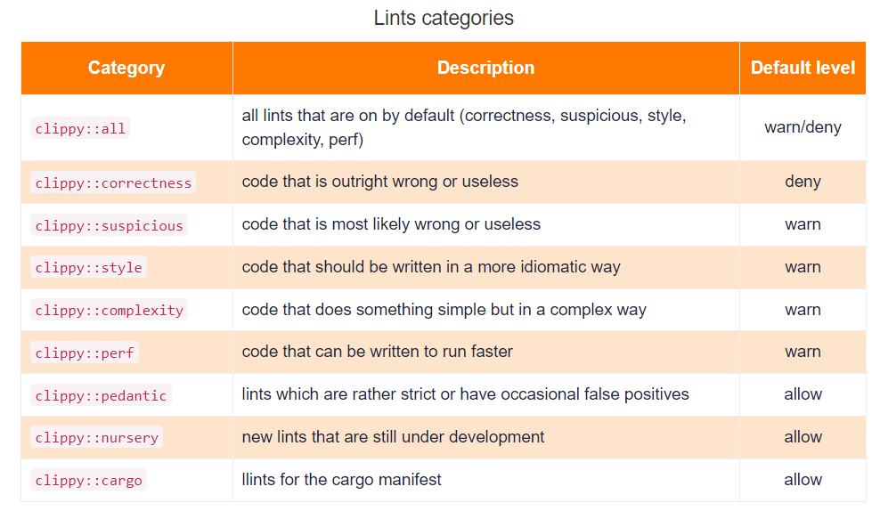

# rustLanguage
> https://careerbooster.teachable.com/courses/1869000/lectures/43616191

通过 ```cargo fmt``` 和 ```cargo clippy``` 格式化和检查代码



- ```cargo-edit```
> provides commands that allow you to add, remove and upgrade dependencies from the command line rather than modifying Cargo.toml by hand.


- ```cargo-udeps```
> tries to determine which dependencies specified in Cargo.toml are not used by any of your code.