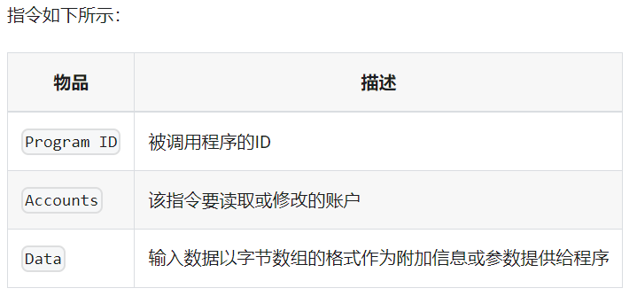

# Solana
交易是solana上的基本活动，用户签名交易，发起创建、更新、删除链上数据的事务

- Signatures:交易签名，确定交易发起者的身份
消息：
- Header: 3 个 uint8 的 字段表示 签名交易的账户数量、拒绝签名的账户数量、只读数据的账户数量
- Account addresses: 交易中使用到的账户数组
- Recent Blockhash：表示最近区块的为一只，确保交易所在连不会太老旧
- Instructions：交易发起时的附带数据，指令的执行时=符合原子性，一条或多条指令中的任何部分失败，则整个事务都会失败。

## Instructions
指令按照在交易中定义的顺序原子性执行。每笔交易按照静态的基本费用 + 根据计算资源工作量计算的动态成本 付手续费。

## Account
Solana账户最多拥有10MB数据空间（存储状态数据 + 程序代码），如果账户中存储代码，则该账户被标注成可执行的并且可以处理交易指令。存储空间的使用需要付费，如果账户无法即使支付租金，该账户下的资源将被删除。

## Program
程序是Solana区块链的基础，程序都是无状态的，不存储任何状态数据，只存储代码。如果程序需要存储事务之间的状态，它会调用账户执行。

程序负责区块链网络中的一切：创建账户、处理交易、收取费用，程序中交互的任何数据都存储在指令传递的单独账户中。
